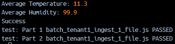
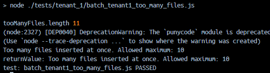
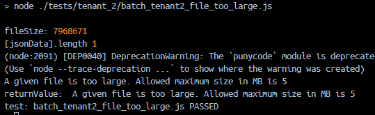
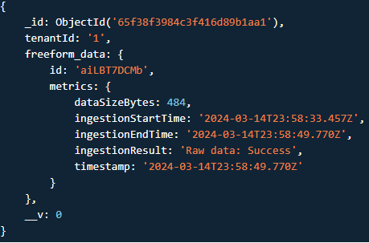
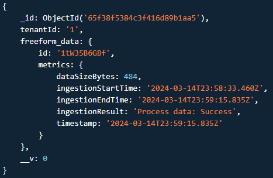
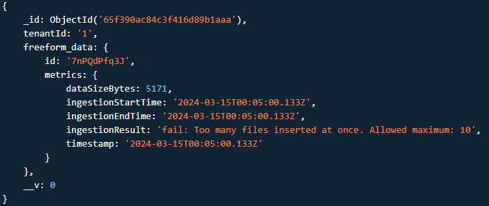
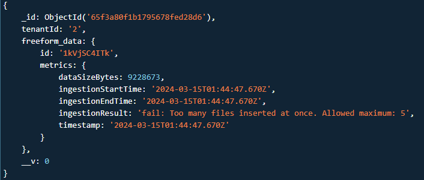

# Assignment Report

# Part 1

## 1. Schemas for a set of constraints for tenant service agreement:
Platform only supports document-based data given as JSON due to that being the simplest and best way to store the data into mongoDB. IoT data from tenants supports the document-based model in a sensible way. Also this type of data is easy to update and analyze consistently.
Both tenants have to pay for uploading and maintaining data in mysimbdp-coredms (mongoDB).

Tenant 1 has a massive amount IoT sensors sending data periodically so they get a better price for the greater amount and have a higher priority. (payment group 1)
Tenant 1 wants to store all of the given data and the processed aggregate data, which leads to them requiring a lot more resources.
### tenant1_schema_constraints:
```json
{
    "tenantId": "1",
    "paymentGroup": "1",
    "data_file_constraints": {
        "file_format": "JSON",
        "max_num_of_files": 10,
        "max_file_size": "10MB"
    },
    "service_agreement_constraints": {
        "agreement_duration_months": 12,
        "cost_per_upload_MB_in_euro": 0.01,
        "cost_per_maintenance_MB_per_month_in_euro": 0.005,
        "service_availability_in_percent": 99
    }
}
```

Tenant 2 sends less IoT sensor data inconsistently so they have more restrictions and more expensive service costs and has lower priority than tenant 1. (payment group 2)
Tenant 2 wants to store only the aggregate data processed from the raw data which takes up less resources but generates less revenue.
### tenant2_schema_constraints:
```json
{
    "tenantId": "2",
    "paymentGroup": "2",
    "data_file_constraints": {
        "file_format": "JSON",
        "max_num_of_files": 5,
        "max_file_size": "5MB"
    },
    "service_agreement_constraints": {
        "agreement_duration_months": 6,
        "cost_per_upload_MB_in_euro": 0.02,
        "cost_per_maintenance_MB_per_month_in_euro": 0.01,
        "service_availability_in_percent": 95
    }
}
```


## 2. clientbatchingestapp:
- read_input_files: read input files in client-staging-input-directory
- data_wrangler: add a new properties "client_id" and "client_name"
- ingestion: start ingesting to mysimbd-coredms by informing mysimbdp-batchingestmanager about the data to be sent.
- processing: send data to be processed by batchprocessor of mysimbdp so aggregate data can also be stored.

- Receives call from batchingestmanager to request data from client-staging-input-directory.
- For tenant 1 only: Requests data from client-staging-input-directory and then sends data to mysimbdp-daas to be ingested to mysimbdp-coredms (mongoDB).
- For both tenants: Requests data from client-staging-input-directory and then sends data to mysimbdp-daas to be processed by batchprocessor to create aggregatedata from the data and then the aggregate data is ingested into mysimbdp-coredms (mongoDB).


## 3. mysimbdp-batchingestmanager bounded:
- Tenant registry (API path /agreements in the database originally uploaded from a configuration file within the program in service_contracts.json)
    - Retrieved from database in mysimbdp-coredms tenant/agreements where the service agreements for the tenants are identified with the tenant id:s.
- Scheduler: scheduleJobs (Scheduling of different tenants clientbatchingestapp:s is done based on the tenants service agreements payment group with 1 being the highest priority)
- Executor: callClientIngestionApp (Execute ingestion pipeline for chosen tenants data)

- Uses Apache Kafka: The cluster of brokers and api to create producers and consumers in mysimbdp developed in assignment one.
- Tenants can can send their data to be ingested and the mysimbdp-batchingestmanager schedules the ingestion jobs and calls mysimbdp-daas ingestion api.
- Data sent as large batches.
- Mysimbdp-daas creates the producers and consumers based on the mysimbdp-batchingestmanager scheduling in order to ingest data into mysimbdp-coredms (MongoDB).
- Clientbatchingestapp sends raw data to sparkProcessor (Apache Spark) that does the final processing to the data and ingest the processed data into mysimbdp-coredms (MongoDB).


## 4. Multi-tenancy model in mysimbdp:
The client first puts files to the input-directory withing the core application of the platform and the input directory calls the manager and the manager calls the clients ingestion app that calls the input-directory for the files.

Client-staging-input-directory check the tenants service agreement and checks if files inserted by the tenant follow the agreement. If yes the process is continue. If not the process is stopped.

#### Shared:
- Mysimbdp-coredms shared between all tenants.
- Mysimbdp-batchingestmanager is used to manage all tenants mysimbdp-clientbatchingestingapp.
- Client-staging-input-directory is shared and data is differentiated to their own sections by the tenant id. A part of mysimbdp.
#### Individual:
- Tenants will have individual nodes in the database for their data. Stored in /tenant/{tenantId}.
- Tenants will have individual kafka producers and consumers that are created when they send data to be ingested and aggregated by calling mysimbdp-daas.
- Tenants have individual service agreement contracts that define schemas for the client data. Stored in /agreements.
- Tenants pay when storing data to and maintaining data in mysimbdp-coredms based on their specific service agreement.
- When a tenant no longer wants to use the service and pay the data maintenance fees their data will be deleted from mysimbdp-coredms in their specific node. Path /tenant/{tenantId}.

- General test for one file:


Performance for ingestion tests for both tenants individually and together (with failures).
Tenants have different constraints.
Show example of data not being ingested due to violation of constraints in the service agreement.

- Failure due to too many files (more than allowed in service agreement for tenant):


- Failure due to a file being too large (larger than allowed in service agreement for tenant):



## 5. Collect logging metrics
- Store tenant logs in individual tenant database paths. At logs/tenantId.

#### Metrics stored:
- dataSizeBytes
- ingestionStartTime
- ingestionEndTime
- ingestionResult
- timestamp

- General test for one file:
 


- Failure due to too many files (more than allowed in service agreement for tenant):


- Failure due to a file being too large (larger than allowed in service agreement for tenant):



# Part 2
Used kafka in assignment 1 and in batch as bounded streaming. So these are pretty much the same.

## 1. mysimbdp-messagingsystem:
- Uses Apache Kafka: The cluster of brokers and api to create producers and consumers in mysimbdp developed in assignment one.
- Tenants can can send their data to be ingested and the mysimbdp-streamingestmanager schedules the ingestion jobs and calls Clientstreamingestapp that calls mysimbdp-daas ingestion api.
- Mysimbdp-daas creates the producers and consumers based on the mysimbdp-streamingingestmanager scheduling in order to ingest data into mysimbdp-coredms (MongoDB).
- Clientstreamingestapp sends raw data to sparkProcessor (Apache Spark) that does the final processing to the data and ingest the processed data into mysimbdp-coredms (MongoDB).

#### Shared:
- Mysimbdp-coredms shared between all tenants.
- Mysimbdp-streamingestmanager is used to manage all tenants clientstreamingestingapp.
- Mysimbdp-messagingsystem is shared.
#### Individual:
- Tenants will have individual nodes in the database for their data.
- Tenants will have individual kafka producers and consumers that are created when they send data to be ingested and the mysimbdp-streamingestmanager calls the api mysimbdp-daas.
- Tenants have individual service agreement contracts that define schemas for the client data.


# 2. mysimbdp-streamingingestmanager unbounded:
- Tenant registry (API path /agreements in the database originally uploaded from a configuration file within the program in service_contracts.json)
    - Retrieved from database in mysimbdp-coredms tenant/agreements where the service agreements for the tenants are identified with the tenant id:s.
- Scheduler: scheduleJobs (Scheduling of different tenants clientstreaningestapp:s is done based on the tenants service agreements payment group with 1 being the highest priority)
- Executor: callClientIngestionApp (Execute ingestion pipeline for chosen tenants data)


## 3. clientstreamingestapp:
Gets data from mysimbdpmessagingsystem and send forward to mysimbdp-daas streamingest api which also has a kafka messagingsytem and mysimbdp-daas streamprocess for data processing.
Tenant 1 has both raw data and aggregate processed data.
Tenant 2 only stores aggregate processed data.
- read_input_files: read input files in mysimbdpmessagingsystem
- data_wrangler: add a new properties "client_id" and "client_name"
- ingestion: start ingesting to mysimbd-coredms by informing mysimbdp-streamingestmanager about the data to be sent.


## 4. clientstreamingestapp report:
- Report format is logs sent as JSON.
- Report sent to mysimbdp-streamingestmonitor that performs necessary actions based on report results.
- Mechanism is calling an api (HTTP POST request) of mysimbdp-streamingestmonitor and the report is sent every 10 minutes when the clientstreamingestapp is active.
- If inactive no report is sent.
- Report JSON schema:
```json
{
    "tenant_id": "string",
    "timestamp": "UTC",
    "average_ingestion_time_ms": "number",
    "total_ingested_data_size_bytes": "number",
    "number_of_messages": "number"
}
```

## 5. mysimbdp-streamingestmonitor receives the report from clientstreamingestapp:
- Clientstreamingestapp calls an api (HTTP POST request) of mysimbdp-streamingestmonitor and the report is sent every 10 minutes when the clientstreamingestapp is active.
- Mysimbdp-streamingestmonitor checks the database api path for these reports at /test/report with specific queryparameters of UTC of the previous 10 minutes.
- Mysimbdp-streamingestmonitor informs mysimbdp-streamingestmanager about the stated of the active clientstreamingestapp:s.
- Mysimbdp-streamingestmanager updates its scheduling based on this information.


# Part 3
## No software implementation only design ideas

## 1.
Each platform provider has their own logging database that has paths based on logs/tenantId where tenants send metrics and other logs. Platform provider can periodically request data from the logging database and create a status report of the whole system.


## 2.
I would recommend multi database/sink usage based on different varieties of the client data. Pretty much the system can storee the client data where it fits best.


## 3.
Token based encryption and client token authorization for retrieving, posting and decrypting data.


## 5.
I would add more identifying metadata to the client data that needs to be ingested and the clientbatchingestapp:s so that they can be used for their specific use cases easier.